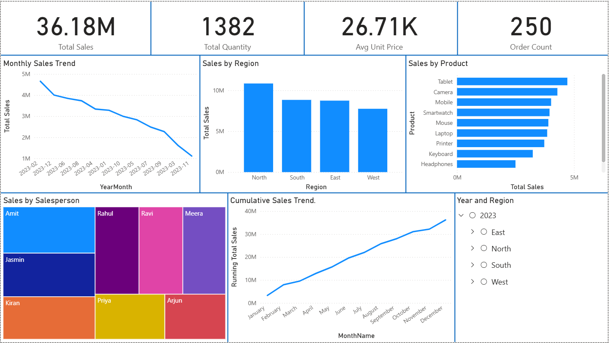

# Sales Performance Dashboard (Power BI)

## Project Overview
This project demonstrates a **Sales Performance Dashboard** built in **Power BI** using a self-created sample dataset (~250 rows).  
The goal of this project was to analyze sales trends, regions, products, and salespersons, while practicing data modeling, DAX, and visualization techniques.

---

## Key Features
- **KPI Cards**: Total Sales, Total Quantity, Average Unit Price, Order Count
- **Sales Trends**: Monthly Sales Trend and Running Total (Cumulative) Sales
- **Breakdown Visuals**:
  - Sales by Region
  - Top 10 Products by Sales
  - Sales by Salesperson
- **Time Intelligence**: Year-over-Year (YoY) Growth %
- **Interactivity**: Slicers for Year, Region, Product, and Salesperson

---

## Tools & Skills Used
- **Power BI**
  - Data Modeling (Fact & Dimension tables, Measures table)
  - DAX Measures (Total Sales, Running Total, YoY %, etc.)
  - Interactive Visualizations (Cards, Line Chart, Bar Chart, Treemap)
- **Data Analysis & Storytelling**

---

## Key Insights
- **North Region** contributed the highest revenue among all regions.  
- **Top-selling products** (e.g., Laptop, Mobile, Accessories) accounted for the majority of sales.  
- **Sales performance peaked in Q3**, showing seasonal growth trends.  
- **Cumulative Sales trend** highlighted steady growth throughout the year.  

---

## Dashboard Preview

---

## Files in this Repository
- `Sales_Performance_Dashboard.pbix` → Power BI dashboard file  
- `sales_dataset.csv` → Dataset used for analysis  
- `dashboard_screenshot.png` → Dashboard preview image  
- `README.md` → Documentation  

---

## How to Use
1. Clone/download this repository.  
2. Open `Sales_Performance_Dashboard.pbix` in Power BI Desktop.  
3. Explore visuals and interact with filters/slicers for deeper insights.  

---

## About This Project
This is a **personal learning project** created to practice **Data Analysis & Visualization with Power BI**.  
It is part of my **Data Analytics Portfolio**, showcasing skills in:  
- Business data storytelling  
- DAX calculations  
- Dashboard design & interactivity  

---
